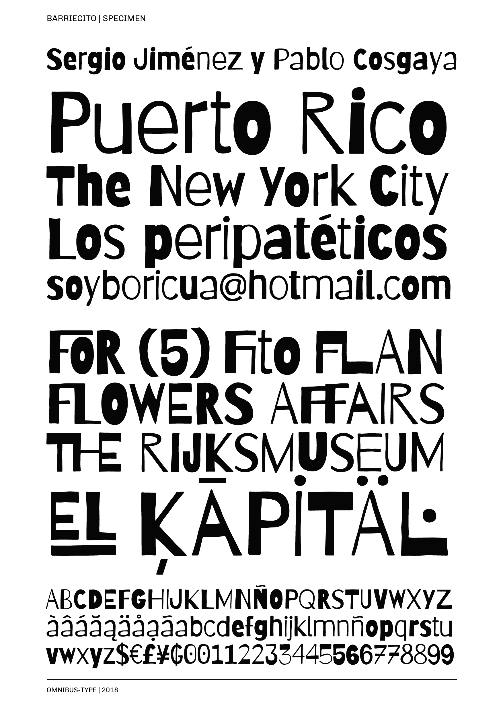

# Barriecito

**Omnibus-Type**  
*SIL Open Font License, 1.1*

Designed to be used both on screen and on billboards, magazines and promotional material of small shops. Particularly remarkable for its rhythmic contrast. Furthermore amateur appearance makes it ideal for warm communication, fun and live. Barriecito offers 647 characters (1234 glyphs) and diacritics with support for over 100 languages (including Guarani). 

To contribute to the project contact [Omnibus Type](http://omnibus-type.com/).

### Designers

* Sergio Jiménez
* Pablo Cosgaya

### License

Copyright (c) 2013-2018, Omnibus-Type (www.omnibus-type.com omnibus.type@gmail.com).

Licensed under the [*SIL Open Font License, 1.1*](http://scripts.sil.org/OFL); you may not use this file except in compliance with the License.

======
## FONTLOG for the Barriecito fonts

This file provides detailed information on the Barriecito font software.  
This information should be distributed along with the Barriecito fonts and any derivative works.

### Barriecito is a typeface family that supports Unicode language range: 

* Basic Latin           U+0020-U+007E
* Latin-1 Supplement    U+00A0-U+00FF
* Latin Extended-A      U+0100-U+017F

**Character map to support MS Codepages:**
* 1252 Latin-1
* 1250 Latin-2 (Easter Europe)
* 1254 Turkish
* 1257 Windows Baltic
* Mac Roman

*To contribute to the project contact Omnibus-Type at omnibus.type@gmail.com*

**1 May 2018 Barriecito v1.007**
- Updated underline
– Expanded set to GF_Latin plus

### Acknowledgements

If you make modifications be sure to add your name (N), email (E), web-address
(if you have one) (W) and description (D). This list is in alphabetical order.
 
**N:** **Yorlmar Campos**  
**E:** omnibus.type@gmail.com  
**W:** http://www.omnibus-type.com  
**D:** Typeface development 

**N:** **Oscar Guerrero Cañizares**  
**E:** omnibus.type@gmail.com  
**W:** http://www.omnibus-type.com  
**D:** Typeface development  

**N:** **Pablo Cosgaya**  
**E:** omnibus.type@gmail.com  
**W:** http://www.omnibus-type.com  
**D:** Designer

**N:** **Sergio Jiménez**  
**E:** omnibus.type@gmail.com  
**W:** http://www.omnibus-type.com  
**D:** Designer

**N:** **Nicolas Silva**  
**E:** omnibus.type@gmail.com  
**W:** http://www.omnibus-type.com  
**D:** Typeface development 
