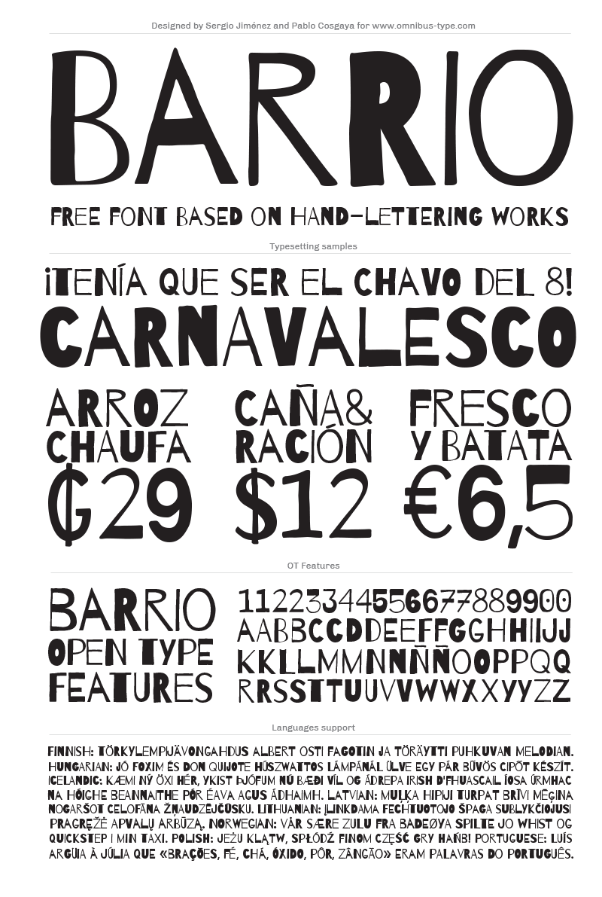

# Barrio

**Omnibus-Type**  
*SIL Open Font License, 1.1*

Designed to be used both on screen and on billboards, magazines and promotional material of small establishments. Particularly remarkable for its rhythmic contrast. Furthermore amateur appearance makes it ideal for warm communication, fun and live. Barrio offers 490 glyphs and diacritics with support for over 103 languages ​​Latin (including Guarani). 

To contribute to the project contact [Omnibus Type](http://omnibus-type.com/).

### Designers

* Sergio Jiménez
* Pablo Cosgaya

### License

Copyright (c) 2013-2015, Omnibus-Type (www.omnibus-type.com omnibus.type@gmail.com).

Licensed under the [*SIL Open Font License, 1.1*](http://scripts.sil.org/OFL); you may not use this file except in compliance with the License.

======
## FONTLOG for the Barrio fonts

This file provides detailed information on the Barrio and Barrio One font software.  
This information should be distributed along with the Barrio fonts and any derivative works.

### Barrio is a typeface family that supports Unicode language range: 

* Basic Latin           U+0020-U+007E
* Latin-1 Supplement    U+00A0-U+00FF
* Latin Extended-A      U+0100-U+017F

**Character map to support MS Codepages:**
* 1252 Latin-1
* 1250 Latin-2 (Easter Europe)
* 1254 Turkish
* 1257 Windows Baltic
* Mac Roman

*To contribute to the project contact Omnibus-Type at omnibus.type@gmail.com*

**03 Feb 2015 (Omnibus-Type) Barrio v.1.4**  
- Removed Reserve Font Name from the license
- fsType Installable Mode
- Set Panose values
- Updates CFF and TTF hinting
- New Verical Metrics

**26 Dec 2013 (Nicolas Silva) Barrio v.1.3**
- Encoding support:
  - Adobe Latin 3
- Improved TTF hint (TTFAutohint 0.97)

**8 jun 2013 (Omnibus-Type) Barrio v.1.2**
- Initial release under SIL Open Font License, this release supports the following:  

Block              | Range
-------------------|--------------
Basic Latin        | U+0020-U+007E
Latin-1 Supplement | U+00A0-U+00FF
Latin Extended-A   | U+0100-U+017F

 
- Character map to support MS Codepages:  
  - 1252 Latin-1
  - 1250 Latin-2 (Easter Europe)
  - 1254 Turkish
  - 1257 Windows Baltic
  - Mac Roman
- Features in OT Tables:
  - GSUB:
    * **aalt** Access All Alternatives
    * **locl** Localized Forms
    * **sups** SuperScript
    * **frac** Diagonal Fractions
    * **ordn** Ordinals
    * **calt** Contextual Alternatives
    * **liga** Standar Ligatures
    * **ss01** Style Set 1
    * **salt** Stylistic Alternatives
      * Single Substitution
      * Ligature Substitution
  - GPOS:
    * **cpsp** Capital Spacing

### Acknowledgements

If you make modifications be sure to add your name (N), email (E), web-address
(if you have one) (W) and description (D). This list is in alphabetical order.

**N:** **Nicolas Silva**  
**E:** omnibus.type@gmail.com  
**W:** http://www.omnibus-type.com  
**D:** Typeface development  

**N:** **Pablo Cosgaya**  
**E:** omnibus.type@gmail.com  
**W:** http://www.omnibus-type.com  
**D:** Designer

**N:** **Sergio Jiménez**  
**E:** omnibus.type@gmail.com  
**W:** http://www.omnibus-type.com  
**D:** Designer